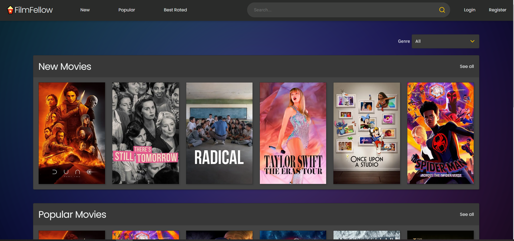

# FilmFellow

## Table of contents

- [About this project](#about)
- [Background](#background)
- [Used framewoks and libraries](#frameworks-libraries)
  - [Client and backend](#project)
  - [Recommender model](#model)
- [How to run project locally](#install)
- [Running tests](#testing)
- [Deployment](#deployment)
- [Future code development](#future-dev)
- [Authors](#authors)

## About this project<a name="about"></a>

Fullstack movie data application where users can find information about different movies with reviews and ratings and get recommendations. Movie data is fetched from [TMDB API](https://developer.themoviedb.org/reference/intro/getting-started)

<div align="center">
    
</div>

## Background<a name="background"></a>

This project was made as a reference group project that was part of Buutti Trainee Academy's program.

## Used frameworks and libraries<a name="frameworks-libraries"></a>

### Client and backend:<a name="project"></a>

[Nextjs](https://nextjs.org/), [NextAuth.js](https://next-auth.js.org/), [TypeScript](https://www.typescriptlang.org/), [React](https://react.dev/), [Sass](https://sass-lang.com/), [React-toastify](https://www.npmjs.com/package/react-toastify), [React Hook Form](https://react-hook-form.com/), [yup](https://www.npmjs.com/package/yup), [Feather icons](https://feathericons.com/), [ESLint](https://eslint.org/), [Prettier](https://prettier.io/), [Docker](https://www.docker.com/), [tsx](https://www.npmjs.com/package/tsx), [argon2](https://www.npmjs.com/package/argon2), [PostgreSQL](https://www.npmjs.com/package/postgresql), [Prisma](https://www.npmjs.com/package/prisma), [vitest](https://www.npmjs.com/package/vitest), [Cypress](https://www.cypress.io/)

### Recommender model:<a name="model"></a>

[Python](https://www.python.org/), [flask](https://flask.palletsprojects.com/en/3.0.x/), [gunicorn](https://gunicorn.org/), [numpy](https://numpy.org/), [sklearn](https://scikit-learn.org/stable/), [pandas](https://pandas.pydata.org/), [scipy](https://scipy.org/), [rapidfuzz](https://pypi.org/project/rapidfuzz/), [requests](https://pypi.org/project/requests/)

## How to run project locally<a name="install"></a>

### Start the database and recommender and run latest migration

```
Copy .env.example to .env in the root folder and inside ./src

docker compose up postgres recommender
```

After database and recommender are running

```
navigate to ./src
npm run prisma:migration
```

(Optional add admin to database)

```
navigate to ./src
npm run init-admin
```

### start Nextjs frontend + backend

```
cd src
npm install
npm run dev
```

## Running tests<a name="testing"></a>

Make sure database is running in docker

### Vitest

```
navigate ./src
npm run test
```

### Cypress

```
navigate ./src
npm run dev
npm run cypress:run_headless
```

## Recommendations

Movie recommendations are given with a Flask app. ML methods are used in the app to calculate similar movies based on ratings or movie features and user recommendations based on user's ratings and favourited movies. It has three endpoints for different kinds of recommendations. The recommender uses MovieLens dataset with roughly 80,000 movies and 30 million ratings.

https://grouplens.org/datasets/movielens/


## Deployment<a name="deployment"></a>

FilmFellow is deployed to Microsoft Azure: Cloud Computing Services.

Link to project: https://filmfellow.azurewebsites.net/

## Future code development <a name= "future-dev"></a>

The source code can be developed over time to handle new features. The following is a list of potential feature enhancements:

- Password recovery and email authentication.
- Realtime communication between users
- Show movie theater where movie can be seen
- Localization

## Authors<a name="authors"></a>

- [Harri Nieminen](https://github.com/Moiman)
- [Jani Myllymaa](https://github.com/Jambo258)
- [Katariina Ruotsalainen](https://github.com/bkruotsalainen)
- [Tommy Niemi](https://github.com/TomToom91)
- [Tommi Tyni](https://github.com/TTyni)
